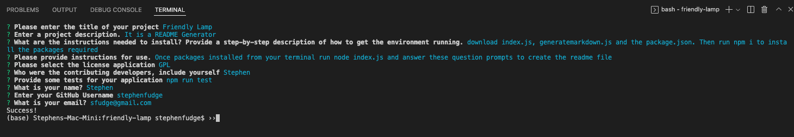

# friendly-lamp

## README Generator - Challenge Assignment 9 Node.JS

- *What was your motivation?*  I wanted to be able to create a README file through the terminal
- *Why did you build this project?*  To have a README template
- *What problem does it solve?*  It solves the problem of having your README files not be consistent or having the pertinent information in them.
- *What did I learn?* I learned about packages and how to call them within the javascript to get the information and to write the README file. 

## Installation

*What are the steps required to install your project? Provide a step-by-step description of how to get the development environment running.*

Download index.js, generateMarkdown.js and the package.json file, then from your terminal run 'npm i' to install the packages associated with this project.

## Usage

*Provide instructions and examples for use. Include screenshots as needed.*

Once you have installed the associated packages, then from your terminal you will want to run 'node index.js' and answer the question prompts that appear to create the README file.

Below is a screenshot of what the terminal should look like when the questions appear.  Within the utils folder there is also a created README that was created using this project with an example of a license.

There is also a [Video Link](https://www.youtube.com/watch?v=ZLnv_ALpKfE)

## Credits
I used w3schools and MDN for help with the switch argument. I used https://www.npmjs.com/ for documentation on the packages so that I knew how to manipulate the data.  
I used https://gist.github.com/lukas-h/2a5d00690736b4c3a7ba for the license badges and links.